## ALF Batch Update Item Attributes

> Small extension for Dynamics 365 Business Central (SaaS / Cloud).
> ALF Batch Update Item Attributes - feature that allow to update items attributes. Source: the existed item. Destination: filtered 'Item List'. New option add to 'Item List'. The extension does not support RunOnTempRec.

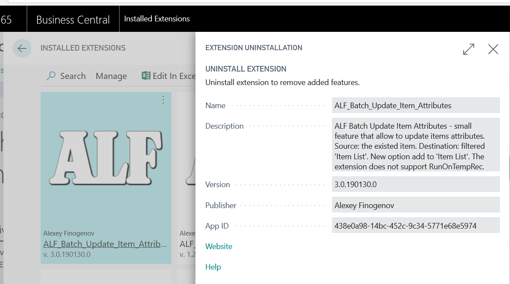

Github project: <https://github.com/finn777/ALF_Batch_Update_Item_Attributes>
 
Readme: <https://github.com/finn777/ALF_Batch_Update_Item_Attributes/blob/master/readme.md>
 
.app file:  <https://github.com/finn777/ALF_Batch_Update_Item_Attributes/blob/master/AL/ALF_Batch_Update_Item_Attributes/Alexey%20Finogenov_ALF_Batch_Update_Item_Attributes_3.0.190130.0.app>

Some key pictures from Visual Code:

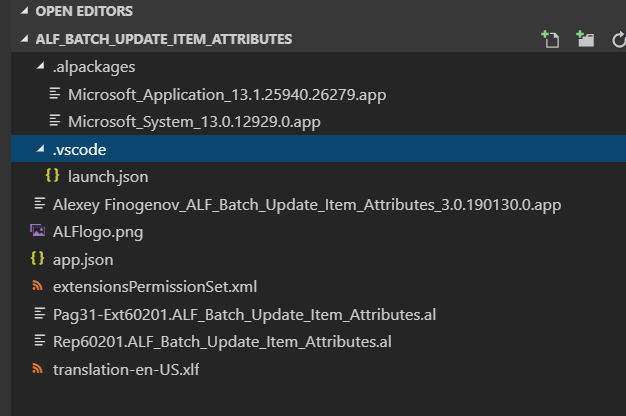

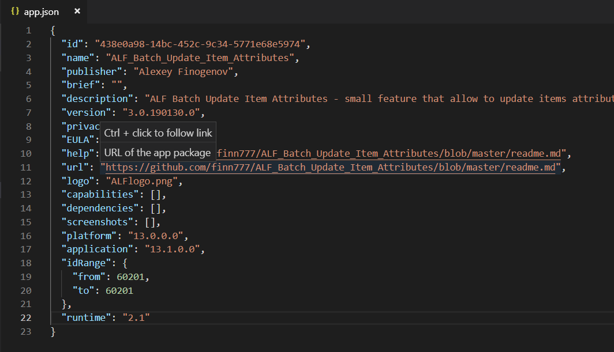

App pictures -

Add new Item attribute - Collection:

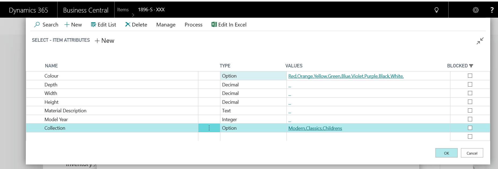

Set Collection and Color for 1896-S item:

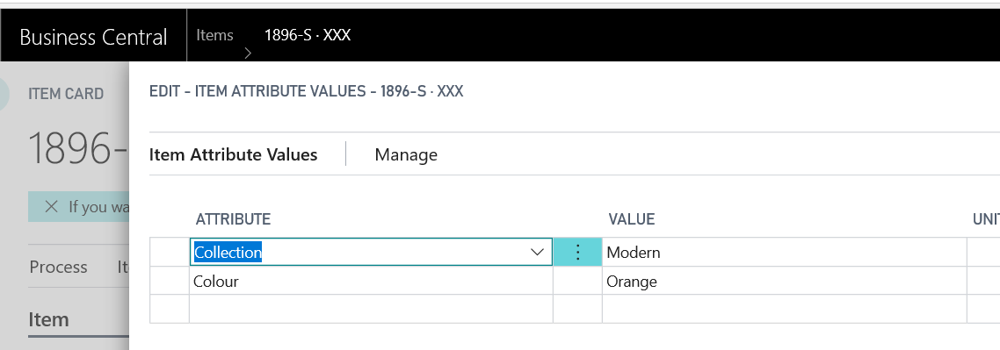

Now filter "Item List" (select items) for which we add Collection and modify Color:

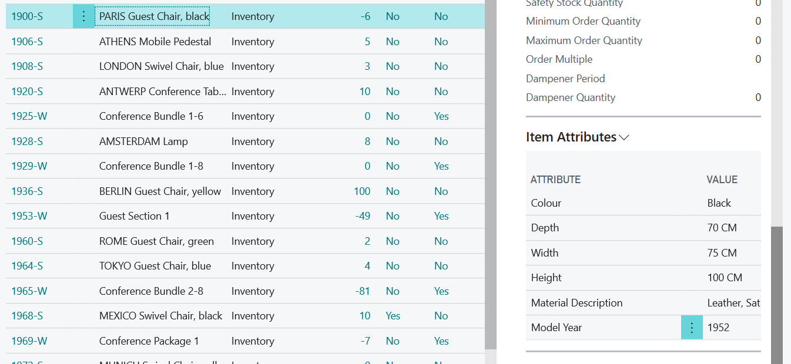

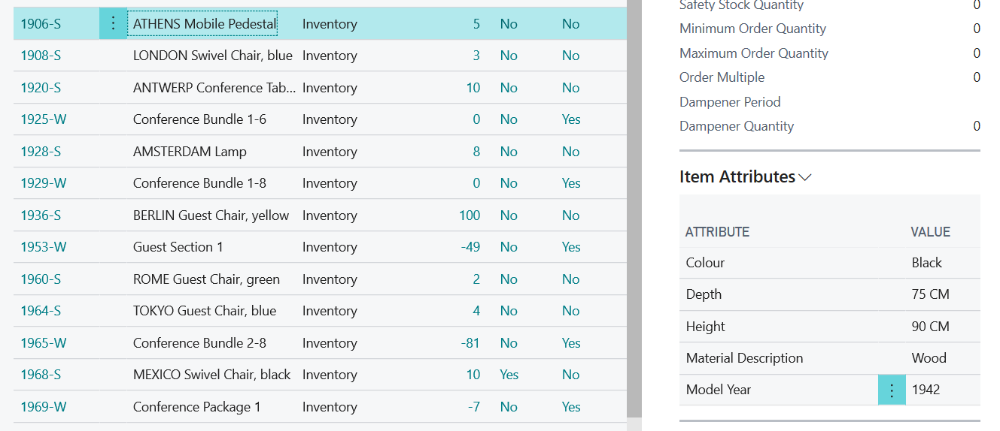

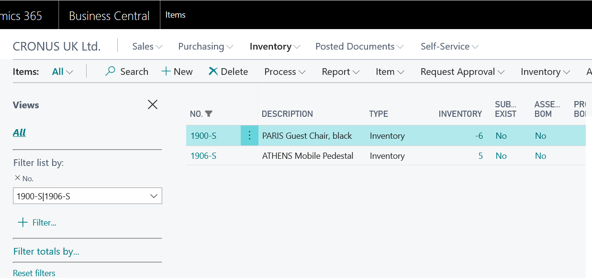

Run ALF Batch Update Item Attributes:

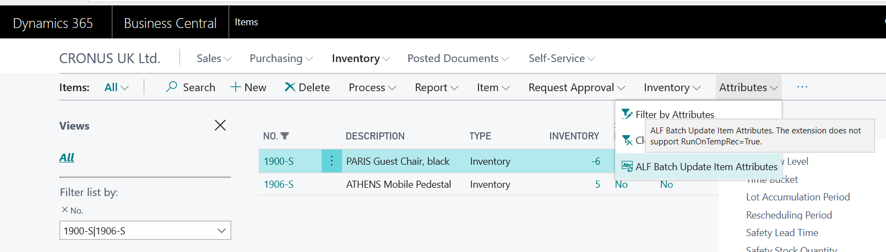

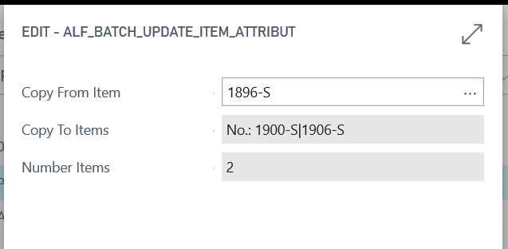

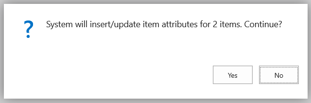

As result:

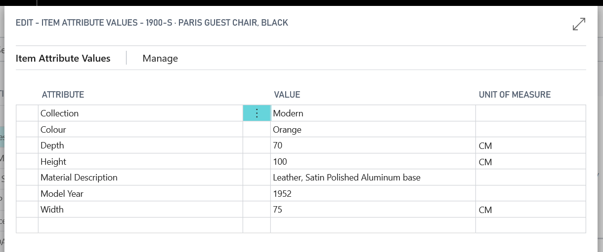

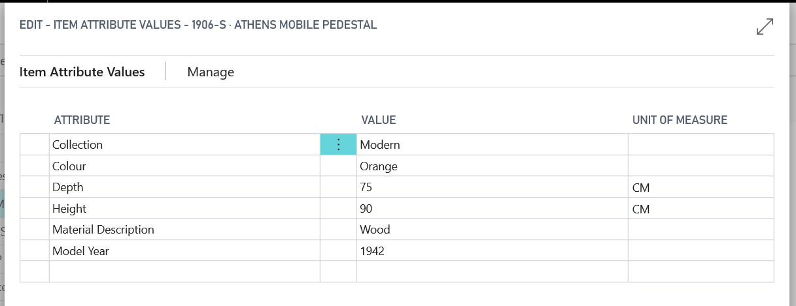
